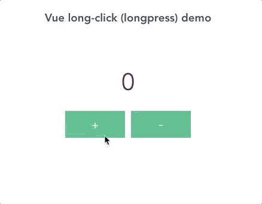

# vue-long-click

> Vue long click (longpress) directive

[](https://www.npmjs.com/package/vue-long-click)

Checkout the demo at https://ittus.github.io/vue-long-click/



## Install

```bash
npm install vue-long-click --save
```

```javascript
import { longClickDirective } from 'vue-long-click'

const longClickInstance = longClickDirective({delay: 400, interval: 50})
Vue.directive('longclick', longClickInstance)
```

## Usage

```javascript
<button v-longclick="() => changeValue(1)">+</button>
```


## Config

| Prop                  | Type            | Default     | Description                              |
|-----------------------|-----------------|-------------|------------------------------------------|
| delay                 | Integer (milliseconds)    |      400     | Delay until long click function is fired             |
| interval                  | Integer (milliseconds)         |    50         | If value is greater than 0, handler function will be fire every `interval` milliseconds when component is pressed

## Development

```bash
## Project setup
yarn install

## Compiles and hot-reloads for development
yarn run serve

## Build library
yarn run build:lib

## Run tests
yarn run test

## Lints and fixes files
yarn run lint
```
